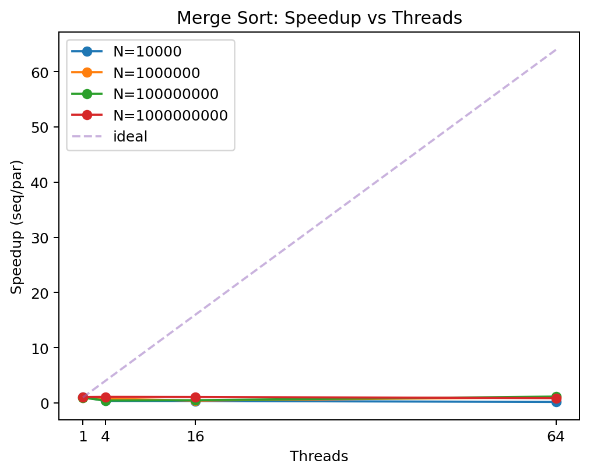
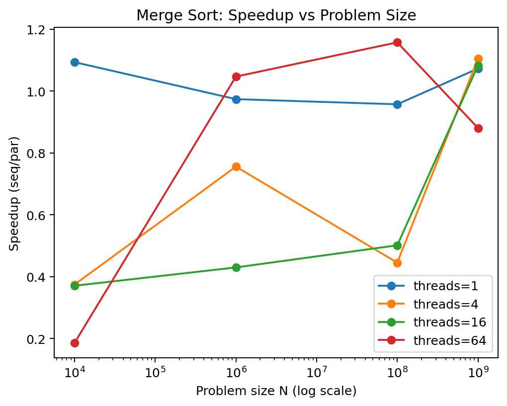
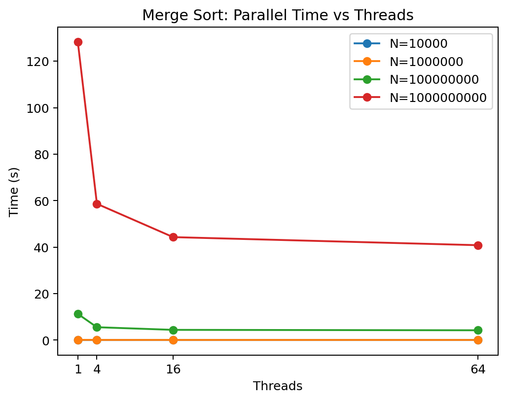
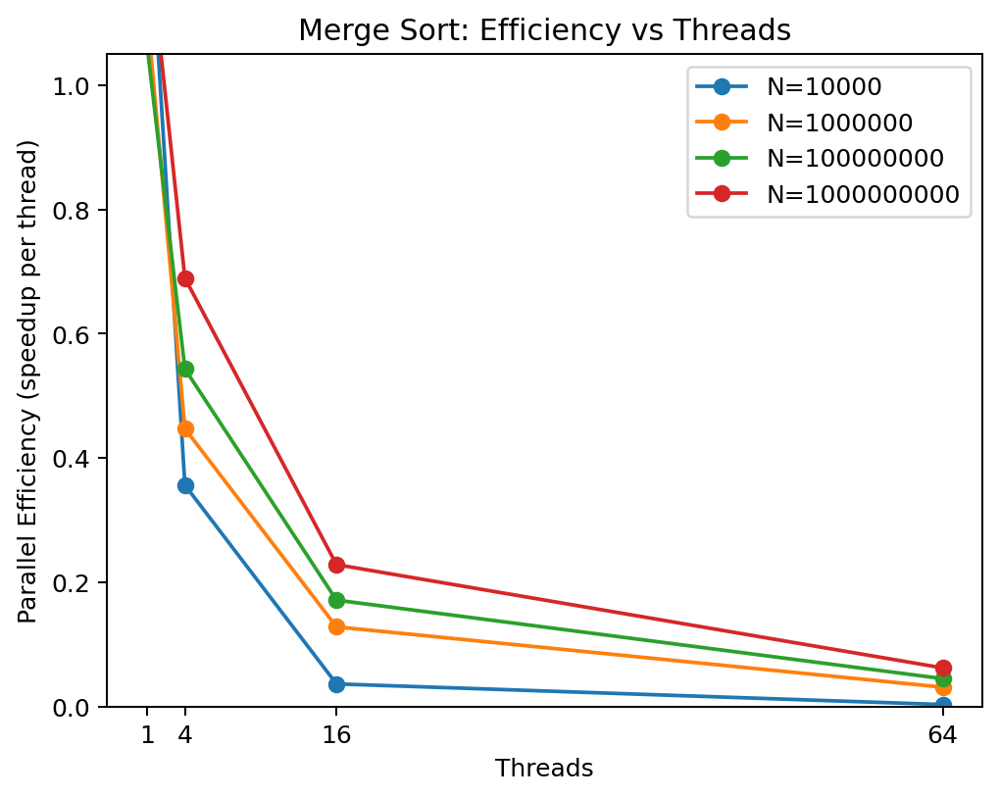

# Merge Sort: Parallelization Study

This project implements and analyzes a **parallel bottom up mergesort** using OpenMP.

Goals:

- Implement a sequential baseline for mergesort.
- Implement a parallel iterative mergesort that uses the `OmpLoop` helper.
- Measure speedup for different input sizes and thread counts.
- Visualize results using the plots in `mergesort/plots/`.

The parallel implementation uses:

- Iterative bottom up mergesort (run widths 1, 2, 4, 8, ...).
- Parallelism across independent merges when there are many merges in a pass.
- Parallelism inside a single merge using a merge path style partitioning when there are only a few large merges.
- Coarsening of loop iterations to reduce OpenMP scheduling overhead.

---

## Build Prerequisites

- C and C++ compiler with OpenMP support (for example `gcc` and `g++`)
- `make` and `bash`
- For plotting:
  - either `gnuplot`
  - or Python 3 with `matplotlib` and `pandas`

---

## Parameters

Common benchmark parameters are defined in `params.sh`:

```bash
THREADS="1 4 16 64"
MERGESORT_NS="10000 1000000 100000000 1000000000"
```

These control the problem sizes and thread counts used by the benchmark scripts.

---

## Building and Running

### 1. Build the shared data library

From the project root:

```bash
make libgen.a
```

Sub makefiles will auto build `libgen.a` if it is missing.

---

### 2. Sequential baseline

```bash
cd sequential
make              # builds mergesort_seq
make bench        # or: bash ./queue.sh
```

This writes one timing file per problem size:

```text
sequential/result/mergesort_seq_<N>
```

Each file contains the runtime in seconds.

Example from this project:

```text
mergesort_seq_1000000    ->  0.0937723
mergesort_seq_100000000  ->  11.9921
mergesort_seq_1000000000 ->  161.663
```

---

### 3. Parallel mergesort

```bash
cd ../mergesort
make              # builds mergesort with OpenMP
make test         # functional and timing format tests
make bench        # or: bash ./queue.sh
```

This produces files of the form:

```text
mergesort/result/mergesort_<N>_<T>
```

Example:

```text
mergesort_100000000_1   -> 11.2595
mergesort_100000000_4   -> 5.51965
mergesort_100000000_16  -> 4.38349
mergesort_100000000_64  -> 4.20281
```

---

## Plotting

You must run the sequential and parallel benchmarks first.

### Option A: gnuplot path

```bash
cd mergesort
make plot          # invokes plot.sh
```

This creates PDF plots:

- `plots/mergesort_speedup_n.pdf`
- `plots/mergesort_speedup_thread.pdf`

### Option B: Python plotting path

If `gnuplot` is not available, `make plot` falls back to:

```bash
python3 plot_py.py
```

This produces:

- `plots/mergesort_speedup_n.pdf` and `.png`
- `plots/mergesort_speedup_thread.pdf` and `.png`
- `plots/mergesort_speedup_table.csv`

For the full plot set and a combined submission PDF, run:

```bash
cd mergesort
python3 plots.py
```

This writes:

- `plots/mergesort_speedup_n.{pdf,png}`
- `plots/mergesort_speedup_thread.{pdf,png}`
- `plots/mergesort_time_vs_threads.{pdf,png}`
- `plots/mergesort_efficiency_vs_threads.{pdf,png}`
- `submission_mergesort.pdf`

---

## Plots (included directly in this README)

Once you have run `plot_py.py` or `plots.py`, the following images will render directly in this README.

### 1. Speedup vs threads for each N

File: `mergesort/plots/mergesort_speedup_n.png`



This plot shows, for each fixed `N`, the speedup

\[
	ext{speedup}(N,T) = rac{T_{	ext{seq}}(N)}{T_{	ext{par}}(N,T)}
\]

as a function of thread count `T`.

---

### 2. Speedup vs problem size for each thread count

File: `mergesort/plots/mergesort_speedup_thread.png`



This plot shows, for each fixed thread count `T`, how the speedup changes as `N` grows. The x axis is logarithmic.

---

### 3. Parallel time vs threads

File: `mergesort/plots/mergesort_time_vs_threads.png`



This plot shows the absolute parallel runtime as a function of thread count for each `N`.

---

### 4. Parallel efficiency vs threads

File: `mergesort/plots/mergesort_efficiency_vs_threads.png`



Parallel efficiency is defined as:

\[
	ext{efficiency}(N,T) = rac{	ext{speedup}(N,T)}{T}
\]

This plot shows how effectively additional threads are used for different `N`.

---

## How the Parallel Algorithm Works

The parallel mergesort in `mergesort.cpp` is iterative and uses two buffers `src` and `dst`.

1. Bottom up passes

   For `width` in `1, 2, 4, 8, ...`:

   - Process blocks of size `2 * width` in `src`.
   - Treat the left and right halves as sorted runs.
   - Merge them into `dst`.
   - Swap `src` and `dst` after each pass.

2. Early passes: serial

   When `width` is smaller than `SERIAL_PASS_THRESHOLD`, merging is done serially. This avoids OpenMP overhead when the runs are tiny.

3. Middle passes: parallel across merges

   For passes with many independent merges, the implementation parallelizes across merges:

   - Compute `merges_this_pass`.
   - Choose a `group` size to coarsen several merges into one iteration.
   - Use `OmpLoop::parfor` to process groups in parallel.

4. Late passes: parallel inside a merge

   When there are only a few large merges, the code parallelizes within each merge using `merge_runs_parallel` and `mergepath_partition`:

   - View the merge of arrays `A` and `B` as an output range of length `lenOut`.
   - For each output index `K`, find `(ia, ib)` such that `ia + ib = K` and that prefix condition holds.
   - Split the output range into tiles. Each tile computes its local `(ia, ib)` boundaries and merges its portion independently.

5. OmpLoop abstraction

   `omploop.hpp` wraps the OpenMP parallel for into a simple interface:

   ```cpp
   OmpLoop loop;
   loop.setNbThread(nbthreads);
   loop.setGranularity(1);

   loop.parfor(beg, end, increment, [&](int i) {
       // work at i
   });
   ```

---

## Speedup Results: Sequential vs Parallel

The numeric data behind the plots is in:

```text
mergesort/plots/mergesort_speedup_table.csv
```

Columns:

- `N` (problem size)
- `threads`
- `seq_time`
- `par_time`
- `speedup = seq_time / par_time`
- `efficiency = speedup / threads`

From the provided data, the best observed speedup per `N` is:

| N             | Threads with best speedup | Best speedup (approximate) |
|--------------:|--------------------------:|----------------------------:|
| 10,000        | 4                         | 1.42 x                      |
| 1,000,000     | 16                        | 2.05 x                      |
| 100,000,000   | 64                        | 2.85 x                      |
| 1,000,000,000 | 64                        | 3.96 x                      |

### Interpretation

- For very small `N`, overhead dominates and speedups are modest, sometimes worse than sequential at high thread counts.
- For moderate `N`, speedup around 2 x is possible with 4 to 16 threads.
- For large and very large `N`, speedups approach about 3 to 4 x with 64 threads. Scaling is sub linear because mergesort is memory bandwidth bound. Each pass streams two input arrays and one output array, and DRAM bandwidth becomes the main bottleneck.

Parallel efficiency shows that small numbers of threads are used more efficiently. At very high thread counts, efficiency is low because the algorithm cannot make full use of all cores when limited by memory bandwidth and non parallelizable work.

---


